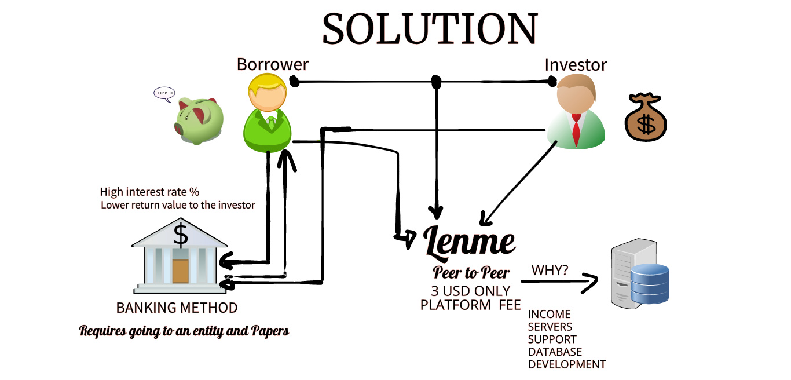
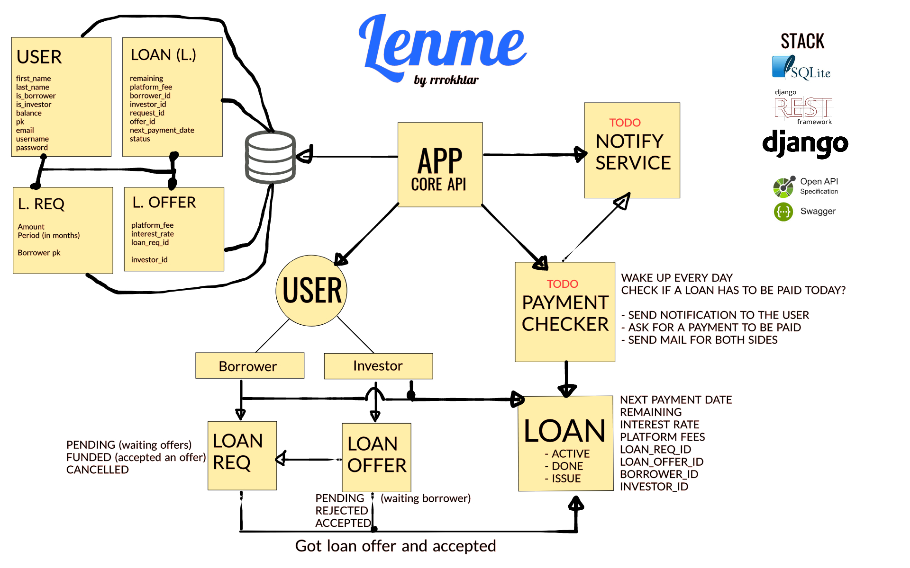
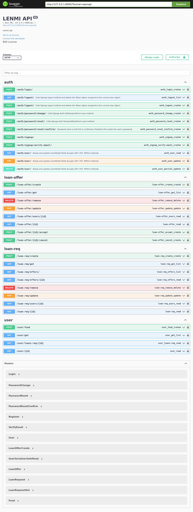

# Welcome to LMS

## How to get started
3. Create a virtual environment ```virtualenv venv```
4. Activate the virtual environment ```source venv/bin/activate```
5. Install the requirements ```pip3 install -r requirements.txt```
6. Run the migrations ``` python manage.py makemigrations core```
6. Run the migrations ```python manage.py migrate```
8. Run the server ```python manage.py runserver```
9. Visit the server at ```http://localhost:8000``` which will show you the API documentation

## Stack
- Django
- Django Rest Framework
- SQLite
- Swagger

## Context




## System Architecture


## API Documentation

### VIEW API DOCUMENTATION [HERE](./API.md)